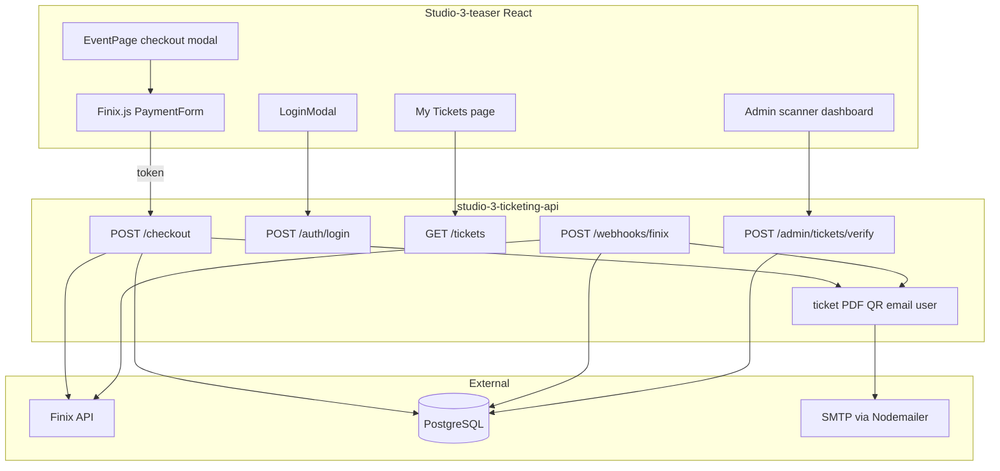

# Studio 3 Event Ticketing — Backend Plan Document

Use this doc when opening the **new backend repo**. The frontend stays in [Studio-3-teaser](file:///Users/sahil/MEGAsync/Freelance/Studio-3-teaser).

---

## Product summary

**Event:** Inside the Mind of an Artist  
**Venue:** Dec on Dragon · 1414 Dragon St, Dallas, TX 75207  
**Date:** Saturday, July 25, 2026 · 8:00 PM – 12:00 AM CDT  
**Price:** $49.95 General Admission (early bird), max **5 tickets** per order  
**Payment:** Finix embedded checkout ([Finix.js](https://docs.finix.com/js) in modal + Finix API on server)

**No separate registration form.** Checkout fields (name, email, phone) create the user account on first successful purchase.

**On successful payment (email via Nodemailer):**
- Auto-generated password (new users only)
- Ticket PDF attachment(s) with **QR on each ticket**
- Instructions to log in and view My Tickets

**Logged-in users:** see tickets at `/tickets`  
**Admin:** dashboard to scan QR on ticket, verify validity, check-in at door

---

## Repo split

| Repo | Role | Deploy target (suggested) |
|------|------|---------------------------|
| **Studio-3-teaser** (existing) | Marketing site + event UI + Finix.js + admin scanner UI | Vercel |
| **studio-3-ticketing-api** (new) | REST API, Prisma, Finix, PDF/QR, email, webhooks | Railway / Fly.io / Render |

Frontend calls backend via `VITE_API_URL`. Backend enables CORS for frontend origin(s).

---

## Architecture



---

## Finix integration (why backend is required)

| Layer | Runs where | Purpose |
|-------|------------|---------|
| **Finix.js** | Browser | PCI-safe card iframe → returns `token` (`TK...`, 30 min TTL) |
| **Finix API** | Backend only | Identity → Payment Instrument → Transfer |
| **Webhooks** | Backend | `transfer.updated` with `state: SUCCEEDED` confirms payment if user closes tab |

**Checkout API flow** ([tokenization guide](https://docs.finix.com/guides/online-payments/payment-tokenization/tokenization-forms)):

1. `POST /identities` (buyer name/email)
2. `POST /payment_instruments` (token from Finix.js)
3. `POST /transfers` (amount = `4995 * quantity` cents, USD)
4. If transfer succeeds → fulfillment (user, tickets, email)

Use raw `fetch` to `https://finix.sandbox-payments-api.com` (Finix Node SDK is optional and lightly maintained).

**Do not** put `FINIX_API_USERNAME` / `FINIX_API_PASSWORD` in the React app. Only `VITE_FINIX_APPLICATION_ID` and `VITE_FINIX_ENV` are public.

---

## Auth model (checkout = registration)

- **No register endpoint exposed to users**
- On **first successful payment** for an email:
  - Create `user` with `role: user`, bcrypt-hashed random password (12–16 chars)
  - Email includes plaintext password once
- On **repeat purchase** same email:
  - Link order/tickets to existing user
  - **Do not** reset password or email a new one (only ticket PDF + “use your existing login”)
- **Login:** `POST /auth/login` → JWT (7–30 day expiry)
- **Admin:** seed at least one `role: admin` user via Prisma seed script (not created via checkout)

---

## Database schema (Prisma)

```prisma
enum UserRole { user admin }
enum OrderStatus { pending paid failed refunded }
enum TicketStatus { valid used cancelled }

model User {
  id           String   @id @default(cuid())
  email        String   @unique
  passwordHash String
  name         String
  phone        String?
  role         UserRole @default(user)
  createdAt    DateTime @default(now())
  orders       Order[]
  tickets      Ticket[]
  scanLogs     ScanLog[] @relation("ScannedBy")
}

model Event {
  id        String   @id @default(cuid())
  slug      String   @unique  // e.g. "inside-the-mind-2026"
  title     String
  venue     String
  address   String
  startsAt  DateTime
  endsAt    DateTime
  priceCents Int     // 4995
  currency  String   @default("USD")
  capacity  Int?     // optional inventory cap
  orders    Order[]
}

model Order {
  id              String      @id @default(cuid())
  userId          String
  user            User        @relation(fields: [userId], references: [id])
  eventId         String
  event           Event       @relation(fields: [eventId], references: [id])
  quantity        Int
  amountCents     Int
  status          OrderStatus @default(pending)
  finixTransferId String?     @unique
  buyerEmail      String
  buyerPhone      String?
  createdAt       DateTime    @default(now())
  tickets         Ticket[]
}

model Ticket {
  id               String       @id @default(cuid())
  orderId          String
  order            Order        @relation(fields: [orderId], references: [id])
  userId           String
  user             User         @relation(fields: [userId], references: [id])
  confirmationCode String       // human-readable e.g. SSC-482917
  qrToken          String       @unique // random 32+ bytes, encoded in QR
  status           TicketStatus @default(valid)
  checkedInAt      DateTime?
  checkedInById    String?
  attendeeName     String
  createdAt        DateTime     @default(now())
  scanLogs         ScanLog[]
}

model ScanLog {
  id        String   @id @default(cuid())
  ticketId  String
  ticket    Ticket   @relation(fields: [ticketId], references: [id])
  adminId   String
  admin     User     @relation("ScannedBy", fields: [adminId], references: [id])
  result    String   // valid | already_used | invalid
  createdAt DateTime @default(now())
}
```

Seed one `Event` row matching current [EventPage.jsx](src/components/EventPage.jsx) constants.

---

## QR on ticket

- Each ticket gets unique `qrToken` (e.g. `crypto.randomBytes(32).toString('base64url')`)
- QR encodes verify URL: `{FRONTEND_URL}/admin/verify?t={qrToken}` (admin scanner reads this)
- Server generates QR as PNG (`qrcode` package) and embeds in PDF (`pdfkit` or `pdf-lib`)
- **One QR per ticket** — quantity 3 → PDF with 3 pages or 3 attachments

Admin verify API accepts `qrToken` (from scan or manual paste), not user passwords.

---

## Email (Nodemailer + SMTP)

Nodemailer works; you still need an **SMTP provider** (not Gmail for production without careful setup):

- SendGrid SMTP, AWS SES SMTP, Mailgun SMTP, or transactional host

**Single email after fulfillment:**

- Subject: e.g. `Your Studio 3 ticket — Inside the Mind of an Artist`
- Body: event details, login URL, email + password (new users only)
- Attachment(s): ticket PDF(s) with QR

Env vars: `SMTP_HOST`, `SMTP_PORT`, `SMTP_USER`, `SMTP_PASS`, `EMAIL_FROM`

---

## Backend API endpoints (new repo)

| Method | Path | Auth | Description |
|--------|------|------|-------------|
| POST | `/checkout` | Public | Body: `token`, `fraudSessionId?`, `quantity`, `name`, `email`, `phone` |
| POST | `/webhooks/finix` | Finix signature | Handle `transfer` created/updated |
| POST | `/auth/login` | Public | Returns JWT |
| GET | `/auth/me` | User JWT | Current user |
| GET | `/tickets` | User JWT | List user's tickets |
| GET | `/tickets/:id/pdf` | User JWT | Re-download PDF |
| POST | `/admin/tickets/verify` | Admin JWT | Body: `qrToken` → ticket details + status |
| POST | `/admin/tickets/check-in` | Admin JWT | Mark `used`, log scan |
| GET | `/admin/orders` | Admin JWT | Order list for dashboard |
| GET | `/health` | Public | Health check |

**Idempotency:** Use `finixTransferId` unique constraint; webhook + checkout must not double-fulfill (check order status before creating tickets/email).

---

## New backend repo structure (recommended)

```
studio-3-ticketing-api/
├── prisma/
│   ├── schema.prisma
│   └── seed.ts              # Event + admin user
├── src/
│   ├── index.ts             # Express app entry
│   ├── config/env.ts
│   ├── middleware/auth.ts
│   ├── routes/
│   │   ├── checkout.ts
│   │   ├── auth.ts
│   │   ├── tickets.ts
│   │   ├── admin.ts
│   │   └── webhooks/finix.ts
│   ├── services/
│   │   ├── finix.ts
│   │   ├── fulfillment.ts   # user, tickets, email orchestration
│   │   ├── ticketPdf.ts
│   │   └── email.ts         # nodemailer
│   └── lib/prisma.ts
├── package.json
├── tsconfig.json
├── .env.example
└── README.md                # COPY OF THIS PLAN + setup steps
```

**Stack:** Node 20+, TypeScript, Express, Prisma, PostgreSQL, bcrypt, jsonwebtoken, nodemailer, qrcode, pdfkit.

---

## Frontend changes (existing repo)

Files to modify/add:

| File | Change |
|------|--------|
| [src/components/EventPage.jsx](src/components/EventPage.jsx) | Replace mock `handleCheckoutSubmit` (lines 207–215) with Finix.js mount + `POST /checkout`; success UI says “check your email” |
| [src/components/LoginModal.jsx](src/components/LoginModal.jsx) | Replace mock `setTimeout` login (lines 48–61) with `POST /auth/login`; persist JWT |
| [src/components/TopBar.jsx](src/components/TopBar.jsx) | Auth state: “My Tickets” link when logged in |
| [src/App.jsx](src/App.jsx) | Routes: `/tickets`, `/admin`, `/admin/verify` |
| `src/context/AuthContext.jsx` | New — JWT storage, `me` fetch |
| `src/pages/MyTicketsPage.jsx` | New — list + download tickets |
| `src/pages/AdminDashboard.jsx` | New — orders list + link to scanner |
| `src/pages/AdminScanner.jsx` | New — `html5-qrcode` camera scan → verify/check-in API |
| `index.html` | Script tag for `https://js.finix.com/v/2/finix.js` |
| `.env.example` | `VITE_API_URL`, `VITE_FINIX_APPLICATION_ID`, `VITE_FINIX_ENV` |

No API routes in Vercel for this design — all server logic lives in the new repo.

---

## Environment variables checklist

**Backend `.env`:**

```bash
DATABASE_URL=
JWT_SECRET=
FRONTEND_URL=https://your-teaser-site.vercel.app

FINIX_ENV=sandbox
FINIX_API_USERNAME=
FINIX_API_PASSWORD=
FINIX_MERCHANT_IDENTITY_ID=
FINIX_WEBHOOK_SECRET=

SMTP_HOST=
SMTP_PORT=587
SMTP_USER=
SMTP_PASS=
EMAIL_FROM=tickets@studio3.dallas

# Optional: EVENT_SLUG default for checkout
```

**Frontend `.env`:**

```bash
VITE_API_URL=https://your-api.railway.app
VITE_FINIX_APPLICATION_ID=
VITE_FINIX_ENV=sandbox
```

---

## Finix Dashboard setup (before coding)

1. Create sandbox account at [finix.com](https://finix.com/)
2. Note Application ID, API credentials, Merchant Identity ID
3. Register webhook URL: `https://api.../webhooks/finix` with `transfer` created + updated
4. Test cards from Finix sandbox docs

---

## Implementation phases

### Phase 1 — Backend foundation
- New repo, Express + Prisma + Postgres, health route, seed event + admin
- Auth login + JWT middleware

### Phase 2 — Checkout + Finix
- Finix service (identity, instrument, transfer)
- `POST /checkout` with pending order → charge → fulfillment on success
- Finix webhook handler (idempotent fulfillment)

### Phase 3 — Tickets + email
- `qrToken`, confirmation codes, PDF generation with QR
- Nodemailer fulfillment email (password for new users + PDF attach)

### Phase 4 — Frontend checkout
- Finix.js in EventPage modal, wire to checkout API

### Phase 5 — User tickets
- AuthContext, real LoginModal, My Tickets page, PDF re-download

### Phase 6 — Admin
- Admin scanner (QR), verify + check-in APIs, orders list UI
- Protect `/admin/*` routes (admin JWT required)

### Phase 7 — Production
- Finix prod credentials, SMTP production sender, CORS locked to prod domain, HTTPS everywhere

---

## Security notes

- Verify Finix webhook signatures ([integrating webhooks](https://docs.finix.com/additional-resources/developers/webhooks/integrating-into-webhooks))
- Never fulfill order until `transfer.state === SUCCEEDED`
- `qrToken` must be unguessable; confirmation code is display-only
- Admin routes require `role === admin`
- Rate-limit `/checkout` and `/auth/login`

---

## What stays unchanged in teaser site

- Landing page sections (Hero, Quote, Marketplace, Studio)
- [RegistrationModal](src/components/RegistrationModal.jsx) for launch list (Google Sheets) — separate from ticketing
- Event page marketing content, countdown, FAQ, poster UI

---

## Copy this doc into the new repo

Add `docs/ARCHITECTURE.md` or root `README.md` in **studio-3-ticketing-api** with this content so context survives switching repos/Cursor sessions.
